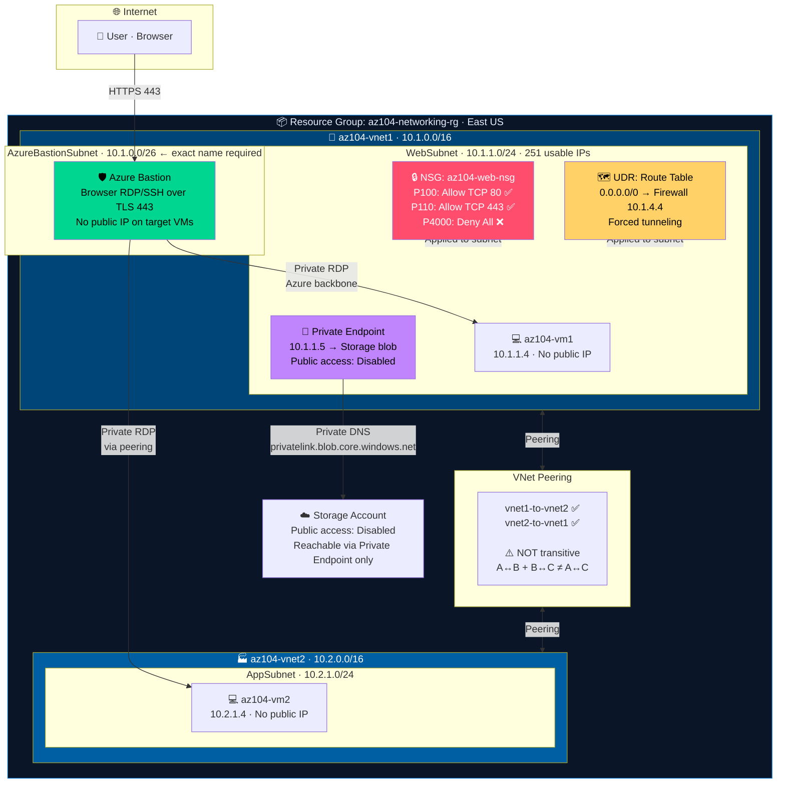
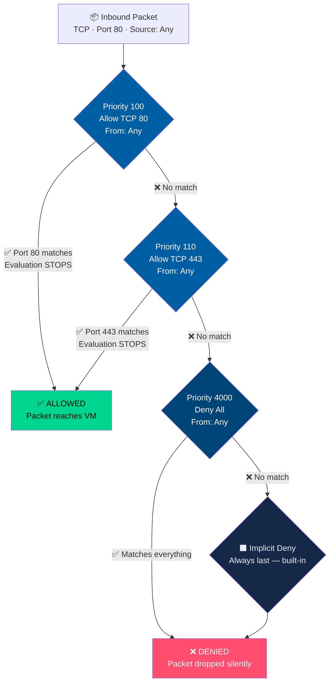
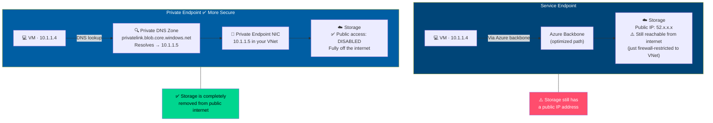

# LAB 04 — Configure and Manage Virtual Networks in Azure

> **Domain:** Implement and Manage Virtual Networking (15–20%)  
> **Estimated Time:** 75 minutes  
> **Difficulty:** Intermediate–Advanced  
> **Official Lab:** [MicrosoftLearning/AZ-104 — LAB 04](https://github.com/MicrosoftLearning/AZ-104-MicrosoftAzureAdministrator/blob/master/Instructions/Labs/LAB_04-Implement_Virtual_Networking.md)

---

## Architecture Diagram



---

## NSG Rule Evaluation Flow



---

## Service Endpoint vs Private Endpoint



---

## Objective

By the end of this lab you will be able to:

- Create **VNets and subnets** with correct CIDR ranges
- Configure **NSGs** with priority rules and understand evaluation order
- Deploy **Azure Bastion** for secure VM access without public IPs
- Configure **VNet Peering** and understand non-transitivity
- Create **UDRs** to force traffic through a firewall
- Implement **Private Endpoints** vs Service Endpoints
- Use **Network Watcher** to troubleshoot connectivity

---

## Prerequisites

- Active Azure subscription
- Azure CLI or Cloud Shell
- Resource group created:

```bash
az group create --name az104-networking-rg --location eastus
```

---

## Key Concepts Cheat Sheet

| Concept | Quick Definition | Exam Trap to Avoid |
|---|---|---|
| **Subnet IP math** | /24 = 256 − 5 reserved = **251 usable** | Azure always reserves exactly 5 IPs |
| **NSG priority** | Lower number = evaluated **first** | 100 is checked before 4000 |
| **VNet peering** | Connect two separate VNets | **NOT transitive** |
| **UDR** | Override Azure's default routing | Required to route traffic through a firewall |
| **Bastion subnet name** | Must be `AzureBastionSubnet` exactly | Wrong name = Bastion won't deploy |
| **Bastion subnet size** | Minimum **/26** | Smaller subnet = deployment fails |
| **Private Endpoint** | PaaS gets a private IP in your VNet | Public access can be fully disabled |

---

## Step-by-Step Instructions

### Task 1 — Create Two Virtual Networks

**VNet-1 (Hub) — 10.1.0.0/16:**
```
Name:   az104-vnet1
Region: East US

Subnet 1:  WebSubnet            10.1.1.0/24
Subnet 2:  AzureBastionSubnet   10.1.0.0/26   ← name must be exact
```

**VNet-2 (Spoke) — 10.2.0.0/16:**
```
Name:   az104-vnet2
Region: East US

Subnet:  AppSubnet   10.2.1.0/24
```

> **Exam tip:** A /24 subnet has 256 addresses. Azure reserves 5: .0 (network), .1 (gateway), .2 and .3 (DNS), .255 (broadcast) = **251 usable** for your resources.

> 📸 **Screenshot checkpoint:** Both VNets showing their address spaces in the portal.

---

### Task 2 — Create and Configure an NSG

**2.1** Portal → **Network security groups** → **+ Create**
```
Name:   az104-web-nsg
Region: East US
```

**2.2** Add inbound security rules:

| Priority | Name | Port | Protocol | Action |
|---|---|---|---|---|
| 100 | Allow-HTTP | 80 | TCP | **Allow** |
| 110 | Allow-HTTPS | 443 | TCP | **Allow** |
| 4000 | Deny-All-Inbound | * | Any | **Deny** |

**2.3** Associate NSG to WebSubnet:
NSG → **Subnets** → **+ Associate** → VNet: az104-vnet1, Subnet: WebSubnet

> **Exam trap:** Priority 100 is evaluated BEFORE priority 4000. First matching rule wins — evaluation stops immediately at that rule.

> 📸 **Screenshot checkpoint:** NSG rules blade showing all three rules and their priority numbers.

---

### Task 3 — Deploy Azure Bastion

**3.1** Portal → **Bastions** → **+ Create**

```
Name:      az104-bastion
Region:    East US
VNet:      az104-vnet1
Subnet:    AzureBastionSubnet (auto-selected)
Public IP: Create new → az104-bastion-pip
SKU:       Basic
```

**3.2** Review + Create → Create (takes ~5 minutes)

> **Why Bastion?** Target VMs need no public IP and no open port 3389 or 22. Access is browser-based over TLS 443. This dramatically reduces attack surface compared to a jump server.

> 📸 **Screenshot checkpoint:** Bastion Overview showing Provisioning State = Succeeded.

---

### Task 4 — Deploy Test VMs (One Per VNet)

**VM-1 in VNet-1:**
```
Name:       az104-vm1
Image:      Windows Server 2022
VNet:       az104-vnet1  /  WebSubnet
Public IP:  None
NIC NSG:    None  (subnet NSG handles it)
```

**VM-2 in VNet-2:**
```
Name:       az104-vm2
VNet:       az104-vnet2  /  AppSubnet
Public IP:  None
```

**Connect to VM-1 via Bastion:** VM-1 → **Connect** → **Bastion** → enter credentials → confirm browser RDP opens

> 📸 **Screenshot checkpoint:** Active Bastion RDP session running in the browser.

---

### Task 5 — Configure VNet Peering

**5.1** az104-vnet1 → **Peerings** → **+ Add**

```
Peering link name (this → remote):  vnet1-to-vnet2
Remote VNet:                         az104-vnet2
Peering link name (remote → this):  vnet2-to-vnet1
Allow virtual network access:        Enabled (both directions)
Allow forwarded traffic:             Enabled
```

**5.2** Click **Add**

**5.3** Verify peering appears in BOTH VNets with status = **Connected**

**5.4** From VM-1 via Bastion → test connectivity to VM-2:
```powershell
Test-NetConnection -ComputerName 10.2.1.4 -Port 3389
```

> **Exam trap:** VNet peering is NOT transitive. VNet-A ↔ VNet-B and VNet-B ↔ VNet-C does NOT give VNet-A ↔ VNet-C. Each pair needs its own explicit peering relationship.

> 📸 **Screenshot checkpoint:** Peering status showing Connected in both VNets.

---

### Task 6 — Configure User-Defined Routes (UDRs)

**6.1** Portal → **Route tables** → **+ Create**
```
Name:   az104-route-table
Region: East US
```

**6.2** Route table → **Routes** → **+ Add**
```
Route name:          Force-Internet-to-Firewall
Address prefix:      0.0.0.0/0
Next hop type:       Virtual appliance
Next hop IP:         10.1.4.4   ← simulates Azure Firewall private IP
```

**6.3** Associate to WebSubnet:
Route table → **Subnets** → **+ Associate** → VNet: az104-vnet1, Subnet: WebSubnet

> **Exam tip:** A 0.0.0.0/0 UDR pointing to a firewall private IP = "forced tunneling" — all internet-bound traffic inspected by the firewall. Without this UDR, spoke VMs bypass hub firewalls even when VNet peering is configured.

---

### Task 7 — Configure a Private Endpoint for Storage

**7.1** Create a storage account:
```bash
az storage account create \
  --name az104storage<initials> \
  --resource-group az104-networking-rg \
  --location eastus \
  --sku Standard_LRS
```

**7.2** Storage account → **Networking** → **Private endpoint connections** → **+ Private endpoint**
```
Name:          az104-storage-pe
Region:        East US
Sub-resource:  blob
VNet:          az104-vnet1  /  WebSubnet
DNS Zone:      privatelink.blob.core.windows.net  (create new)
```

**7.3** Disable public access:
Storage → **Networking** → Public network access: **Disabled** → **Save**

**7.4** From VM-1 via Bastion, verify DNS resolution:
```powershell
nslookup az104storage<initials>.blob.core.windows.net
# Must return 10.x.x.x (private IP) — NOT a public IP
```

---

### Task 8 — Use Network Watcher

**8.1** Portal → **Network Watcher** → **IP Flow Verify**
```
Virtual machine:  az104-vm1
Direction:        Inbound
Protocol:         TCP
Local port:       80
Remote IP:        1.2.3.4
Remote port:      12345
```
→ Review which NSG rule name allows or denies the traffic

**8.2** Network Watcher → **Connection Troubleshoot**
```
Source:       az104-vm1
Destination:  10.2.1.4
Port:         3389
Protocol:     TCP
```
→ Connectivity should succeed after peering is configured

> **Exam distinction:** IP Flow Verify = instant on-demand NSG rule check (which rule matched THIS packet). Connection Troubleshoot = full end-to-end connectivity test between two endpoints.

> 📸 **Screenshot checkpoint:** IP Flow Verify result showing the NSG rule name that was matched.

---

### Task 9 — Clean Up Resources

```bash
az group delete --name az104-networking-rg --yes --no-wait
```

---

## Troubleshooting

| Issue | Resolution |
|---|---|
| Peering shows Disconnected | Both sides of the peering must be created — check both VNets |
| VM can't reach peered VM | Check NSG rules on both subnets for Deny rules blocking the traffic |
| Bastion won't deploy | AzureBastionSubnet must be named exactly right and be /26 or larger |
| Private endpoint DNS returns public IP | Private DNS Zone must be linked to the VNet |
| UDR breaks all connectivity | Verify next hop IP is reachable — wrong NVA IP silently drops all traffic |

---

## Exam Topics Covered

- [ ] Create VNets and subnets with correct CIDR notation
- [ ] Calculate usable IPs per subnet (total − 5 Azure reserved)
- [ ] Configure NSG rules with correct priority numbers
- [ ] Associate NSG to subnet vs NIC (both are valid)
- [ ] Deploy Azure Bastion and connect without public IPs
- [ ] Configure bidirectional VNet peering
- [ ] Explain why peering is non-transitive
- [ ] Create UDRs and associate Route Tables to subnets
- [ ] Configure Private Endpoints vs Service Endpoints
- [ ] Use IP Flow Verify and Connection Troubleshoot in Network Watcher

---

## Official Resources

- [Virtual Network documentation](https://learn.microsoft.com/en-us/azure/virtual-network/)
- [Network Security Groups](https://learn.microsoft.com/en-us/azure/virtual-network/network-security-groups-overview)
- [Azure Bastion](https://learn.microsoft.com/en-us/azure/bastion/)
- [VNet Peering](https://learn.microsoft.com/en-us/azure/virtual-network/virtual-network-peering-overview)
- [Private Endpoints](https://learn.microsoft.com/en-us/azure/private-link/private-endpoint-overview)
- [Official Lab 04 Instructions](https://github.com/MicrosoftLearning/AZ-104-MicrosoftAzureAdministrator/blob/master/Instructions/Labs/LAB_04-Implement_Virtual_Networking.md)

---

*Glen Page | Cloud Engineer | [github.com/glenpagesr-dev](https://github.com/glenpagesr-dev)*
