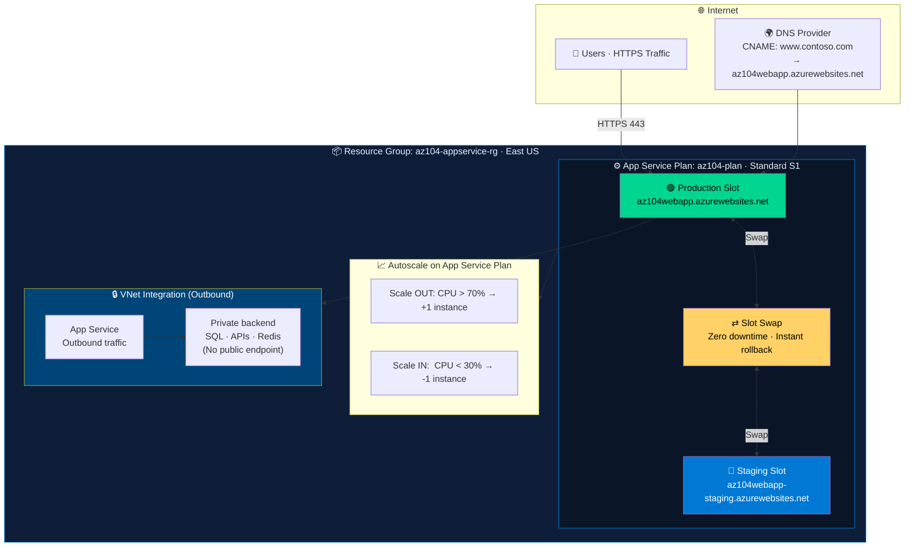
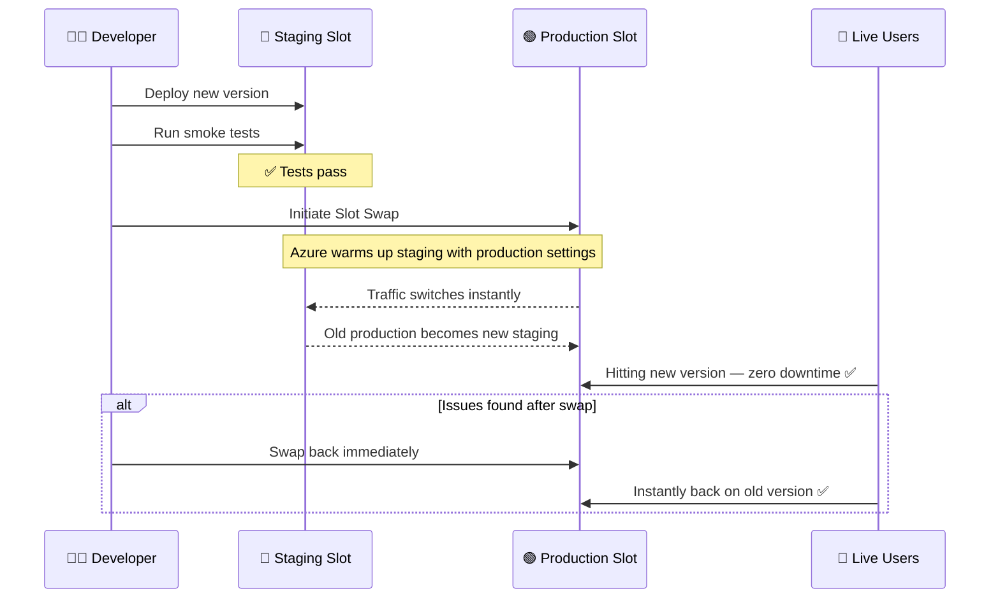
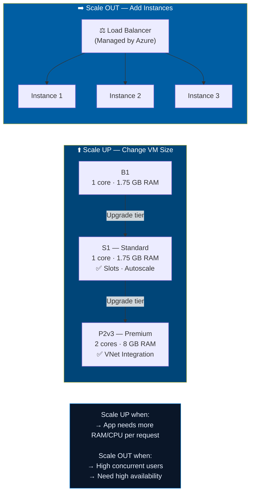

# LAB 09a — Create and Configure an Azure App Service

> **Domain:** Deploy and Manage Azure Compute Resources (20–25%)  
> **Estimated Time:** 60 minutes  
> **Difficulty:** Intermediate  
> **Official Lab:** [MicrosoftLearning/AZ-104 — LAB 09a](https://github.com/MicrosoftLearning/AZ-104-MicrosoftAzureAdministrator/blob/master/Instructions/Labs/LAB_09a-Implement_Web_Apps.md)

---

## Architecture Diagram



---

## Deployment Slot Swap Flow



---

## Scale Up vs Scale Out



---

## Objective

By the end of this lab you will be able to:

- Create an **App Service Plan** and **Web App**
- Configure **application settings** and **connection strings**
- Use **deployment slots** for zero-downtime deployments
- Configure **autoscale** rules based on CPU metrics
- Map a **custom domain** using a CNAME record
- Enable **VNet Integration** for outbound private connectivity

---

## Prerequisites

- Active Azure subscription
- Azure CLI or Cloud Shell
- Resource group created:

```bash
az group create --name az104-appservice-rg --location eastus
```

---

## Key Concepts

| Concept | What It Means | Exam Tip |
|---|---|---|
| **App Service Plan** | Defines compute: region, VM size, instance count | Multiple apps share one plan |
| **Deployment Slots** | Live staging environments within one App Service | Standard tier minimum |
| **Scale Up** | Larger VM size per instance | Changes the plan tier |
| **Scale Out** | More VM instances | Autoscale rules live on the Plan |
| **VNet Integration** | Outbound access to private VNet resources | Does NOT make inbound private |
| **Always On** | Prevents cold starts | Requires Basic tier or higher |

---

## Step-by-Step Instructions

### Task 1 — Create an App Service Plan

**1.1** Portal → **App Service plans** → **+ Create**

```
Resource Group:   az104-appservice-rg
Name:             az104-plan
Operating System: Linux
Region:           East US
Pricing plan:     Standard S1
```

> **Why Standard S1?** Free and Basic tiers do NOT support deployment slots or autoscale — both are exam objectives. S1 is the minimum tier for these features.

---

### Task 2 — Create a Web App

**2.1** Portal → **App Services** → **+ Create** → **Web App**

```
Resource Group:    az104-appservice-rg
Name:              az104webapp<your-initials>
Publish:           Code
Runtime stack:     Node 18 LTS
Operating System:  Linux
Region:            East US
App Service Plan:  az104-plan (select existing)
```

**2.2** Review + Create → Create

**2.3** Once deployed → **Overview** → click **Default domain** → confirm default page loads

> 📸 **Screenshot checkpoint:** App Service Overview showing default domain and Status = Running.

---

### Task 3 — Configure Application Settings

**3.1** App Service → **Configuration** → **Application settings** → **+ New application setting**

```
Name:   ENVIRONMENT    Value: production
Name:   API_TIMEOUT    Value: 30
```

**3.2** Click **Save** → **Continue**

> **Exam tip:** App settings become environment variables inside the app. Mark them as **deployment slot setting** (slot-sticky) to prevent them from swapping with the slot.

---

### Task 4 — Create a Deployment Slot

**4.1** App Service → **Deployment slots** → **+ Add Slot**

```
Name:                staging
Clone settings from: az104webapp<your-initials>
```

**4.2** Note the staging slot URL:
```
https://az104webapp<your-initials>-staging.azurewebsites.net
```

> 📸 **Screenshot checkpoint:** Deployment Slots blade showing both production and staging slots.

---

### Task 5 — Deploy Code to Staging and Swap

**5.1** Click the **staging** slot → **Deployment Center** → Source: **External Git**

```
Repository: https://github.com/Azure-Samples/nodejs-docs-hello-world
Branch:     main
```

**5.2** Click **Save** → browse staging URL → confirm app runs

**5.3** Back in main App Service → **Deployment slots** → **Swap**:

```
Source:   staging
Target:   production
```

**5.4** Review the preview → click **Swap**

**5.5** Browse production URL → confirm the new app is live

> **Exam tip:** The old production content is now in the staging slot — that IS your instant rollback. Swap again to revert.

---

### Task 6 — Configure Autoscale

**6.1** App Service Plan → **Scale out (App Service Plan)** → **Custom autoscale**

Set instance limits:
```
Minimum:   1
Maximum:   5
Default:   1
```

**Scale-out rule:**
```
Metric:      CPU Percentage
Operator:    Greater than
Threshold:   70
Duration:    5 minutes
Action:      Increase count by 1
Cool down:   5 minutes
```

**Scale-in rule:**
```
Metric:      CPU Percentage
Operator:    Less than
Threshold:   30
Duration:    5 minutes
Action:      Decrease count by 1
Cool down:   5 minutes
```

**6.2** Click **Save**

> 📸 **Screenshot checkpoint:** Autoscale configuration showing both scale-out and scale-in rules.

---

### Task 7 — Map a Custom Domain

**7.1** App Service → **Custom domains** → **+ Add custom domain**

**7.2** Enter `www.yourdomain.com` → portal shows required DNS records:

```
Type:  CNAME    Name: www           Value: az104webapp<initials>.azurewebsites.net
Type:  TXT      Name: asuid.www     Value: <verification ID shown in portal>
```

**7.3** Add records at your DNS provider → wait for propagation → click **Validate** → **Add custom domain**

> **Exam trap:** Subdomains = CNAME record. Apex domains (no subdomain, e.g. contoso.com) = A record or Azure DNS alias record. CNAME cannot be used for apex domains per RFC specification.

---

### Task 8 — Enable VNet Integration

**8.1** App Service → **Networking** → **VNet Integration** → **Add VNet Integration**

**8.2** Select your VNet and a dedicated subnet (must be delegated to `Microsoft.Web/serverFarms`)

> **Exam distinction:** VNet Integration = OUTBOUND from App Service into VNet (reach private databases). Private Endpoint ON the App Service = INBOUND from VNet only (private inbound access). Both can be used together.

---

### Task 9 — Clean Up Resources

```bash
az group delete --name az104-appservice-rg --yes --no-wait
```

---

## Troubleshooting

| Issue | Resolution |
|---|---|
| Deployment slots grayed out | Upgrade App Service Plan to Standard S1 or higher |
| Custom domain validation fails | DNS records haven't propagated — wait 10–15 minutes |
| Autoscale not triggering | Check cool down period; verify metric name is correct |
| VNet Integration subnet error | Subnet must be delegated to `Microsoft.Web/serverFarms` |
| App won't start after swap | Check Log Stream or Application Insights for startup errors |

---

## Exam Topics Covered

- [ ] Create and configure App Service Plan (tier selection matters)
- [ ] Deploy a web app on Linux or Windows
- [ ] Configure application settings and connection strings
- [ ] Create deployment slots and perform a zero-downtime slot swap
- [ ] Configure autoscale rules (scale-out and scale-in with cooldown)
- [ ] Map a custom domain using CNAME (subdomain) vs A record (apex)
- [ ] Configure VNet Integration for outbound private connectivity

---

## Official Resources

- [App Service documentation](https://learn.microsoft.com/en-us/azure/app-service/)
- [Deployment slots](https://learn.microsoft.com/en-us/azure/app-service/deploy-staging-slots)
- [Autoscale in App Service](https://learn.microsoft.com/en-us/azure/app-service/manage-scale-up)
- [VNet Integration](https://learn.microsoft.com/en-us/azure/app-service/overview-vnet-integration)
- [Official Lab 09a Instructions](https://github.com/MicrosoftLearning/AZ-104-MicrosoftAzureAdministrator/blob/master/Instructions/Labs/LAB_09a-Implement_Web_Apps.md)

---

*Glen Page | Cloud Engineer | [github.com/glenpagesr-dev](https://github.com/glenpagesr-dev)*
