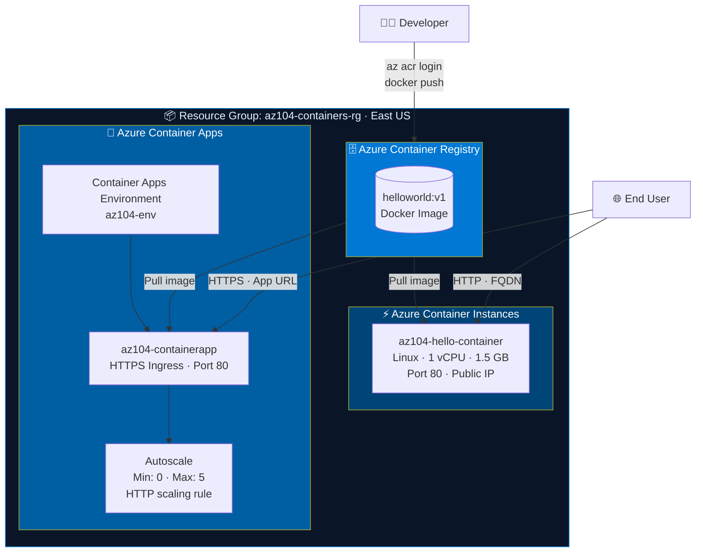
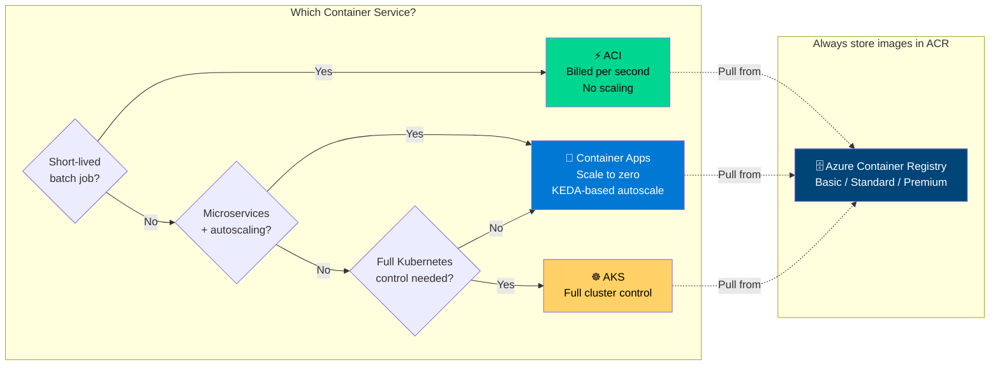

# LAB 09b — Provision and Manage Containers in Azure

> **Domain:** Deploy and Manage Azure Compute Resources (20–25%)  
> **Estimated Time:** 60 minutes  
> **Difficulty:** Intermediate  
> **Official Lab:** [MicrosoftLearning/AZ-104 — LAB 09b](https://github.com/MicrosoftLearning/AZ-104-MicrosoftAzureAdministrator/blob/master/Instructions/Labs/LAB_09b-Implement_Azure_Container_Instances.md)

---

## Architecture Diagram



---

## Service Decision Diagram



---

## Objective

By the end of this lab you will be able to:

- Create and configure an **Azure Container Registry (ACR)**
- Push a Docker image to ACR via Azure CLI
- Deploy a container using **Azure Container Instances (ACI)**
- Deploy a containerized app using **Azure Container Apps**
- Configure **scale-to-zero** and HTTP-based autoscaling
- Know when to use ACI vs Container Apps vs AKS

---

## Prerequisites

- Active Azure subscription
- Azure CLI installed or use Azure Cloud Shell
- Resource group created:

```bash
az group create --name az104-containers-rg --location eastus
```

---

## Key Concepts

| Service | Use Case | Scaling | Cost Model |
|---|---|---|---|
| **ACI** | Short-lived, on-demand containers | Manual only | Per second |
| **Container Apps** | Microservices, event-driven, HTTP | Auto (KEDA) | Per vCPU/memory |
| **AKS** | Complex Kubernetes workloads | Full control | Per node VM |
| **ACR** | Private Docker image registry | N/A | Per storage GB |

> **Exam tip:** ACI bills per second and has no autoscale. Container Apps can scale to zero. AKS requires managing the cluster yourself.

---

## Step-by-Step Instructions

### Task 1 — Create an Azure Container Registry (ACR)

**1.1** Portal → **Container registries** → **+ Create**

```
Resource Group:   az104-containers-rg
Registry name:    az104acr<your-initials>
Location:         East US
SKU:              Basic
```

**1.2** After creation → **Settings** → **Access keys** → enable **Admin user**

> **Why this matters:** ACR stores your private Docker images. The Admin user allows username/password authentication from CLI.

---

### Task 2 — Push a Docker Image to ACR

**2.1** Open **Azure Cloud Shell** (bash)

**2.2** Log in to your registry:
```bash
az acr login --name az104acr<your-initials>
```

**2.3** Pull a sample image:
```bash
docker pull mcr.microsoft.com/azuredocs/aci-helloworld:latest
```

**2.4** Tag it for your registry:
```bash
docker tag mcr.microsoft.com/azuredocs/aci-helloworld \
  az104acr<your-initials>.azurecr.io/helloworld:v1
```

**2.5** Push to ACR:
```bash
docker push az104acr<your-initials>.azurecr.io/helloworld:v1
```

**2.6** Verify: ACR → **Repositories** → confirm `helloworld` appears

> 📸 **Screenshot checkpoint:** Repositories blade showing your pushed image.

---

### Task 3 — Deploy with Azure Container Instances

**3.1** Portal → **Container instances** → **+ Create**

```
Container name:    az104-hello-container
Region:            East US
Image source:      Azure Container Registry
Registry:          az104acr<your-initials>
Image:             helloworld:v1
OS type:           Linux
Size:              1 vcpu, 1.5 GiB memory
```

**Networking tab:**
```
Networking type:   Public
DNS name label:    az104hello<your-initials>
Port:              80 (TCP)
```

**Advanced tab:**
```
Restart policy:    On failure
```

**3.2** Review + Create → Create

**3.3** Once deployed → copy **FQDN** → open in browser → confirm hello world page loads

> 📸 **Screenshot checkpoint:** Container instance Overview showing Status = Running and the FQDN.

---

### Task 4 — Review Container Logs and Events

**4.1** Container instance → **Containers** → **Logs** tab → review HTTP requests

**4.2** Click **Events** tab → review Pull, Create, Start events

> **Exam tip:** Events = image pull failures show here. Logs = application errors show here. Check Events first when a container won't start.

---

### Task 5 — Deploy Azure Container Apps

**5.1** Portal → **Container Apps** → **+ Create**

```
Container app name:          az104-containerapp
Region:                      East US
Container Apps Environment:  Create new → az104-env
```

**Container tab:**
```
Image:    mcr.microsoft.com/azuredocs/containerapps-helloworld:latest
CPU:      0.25 cores
Memory:   0.5 Gi
```

**Ingress tab:**
```
HTTP Ingress:   Enabled
Traffic:        Accepting traffic from anywhere
Target port:    80
```

**5.2** Review + Create → Create

**5.3** Overview → click **Application URL** → confirm app loads in browser

> 📸 **Screenshot checkpoint:** Container App Overview showing Application URL and Status = Running.

---

### Task 6 — Configure Scale to Zero

**6.1** Container App → **Scale** blade

```
Min replicas:   0
Max replicas:   5
```

Add a scale rule:
```
Rule name:            http-scaling
Type:                 HTTP scaling
Concurrent requests:  10
```

**6.2** Click **Save**

> **Why this matters:** Min replicas = 0 means the app scales to zero when idle — zero cost. When traffic arrives, it scales up automatically. This is the key Container Apps differentiator vs ACI.

---

### Task 7 — Clean Up Resources

```bash
az group delete --name az104-containers-rg --yes --no-wait
```

> ⚠️ Always delete resources after labs to avoid charges.

---

## Troubleshooting

| Issue | Resolution |
|---|---|
| ACI fails to pull from ACR | Enable Admin user on ACR or use Managed Identity |
| Container stays in "Waiting" state | Check Events tab — usually an image pull error or wrong tag |
| Container App URL returns 404 | Verify target port matches what the container actually listens on |
| ACR push unauthorized | Re-run `az acr login --name <registry>` |

---

## Exam Topics Covered

- [ ] Create and configure Azure Container Registry
- [ ] Push Docker images to ACR via CLI
- [ ] Deploy ACI with public IP, DNS label, and restart policy
- [ ] View container logs and events for troubleshooting
- [ ] Deploy Azure Container Apps with HTTP ingress
- [ ] Configure autoscale with scale-to-zero
- [ ] Identify when to use ACI vs Container Apps vs AKS

---

## Official Resources

- [Azure Container Instances docs](https://learn.microsoft.com/en-us/azure/container-instances/)
- [Azure Container Apps docs](https://learn.microsoft.com/en-us/azure/container-apps/)
- [Azure Container Registry docs](https://learn.microsoft.com/en-us/azure/container-registry/)
- [Official Lab 09b Instructions](https://github.com/MicrosoftLearning/AZ-104-MicrosoftAzureAdministrator/blob/master/Instructions/Labs/LAB_09b-Implement_Azure_Container_Instances.md)

---

*Glen Page | Cloud Engineer | [github.com/glenpagesr-dev](https://github.com/glenpagesr-dev)*
