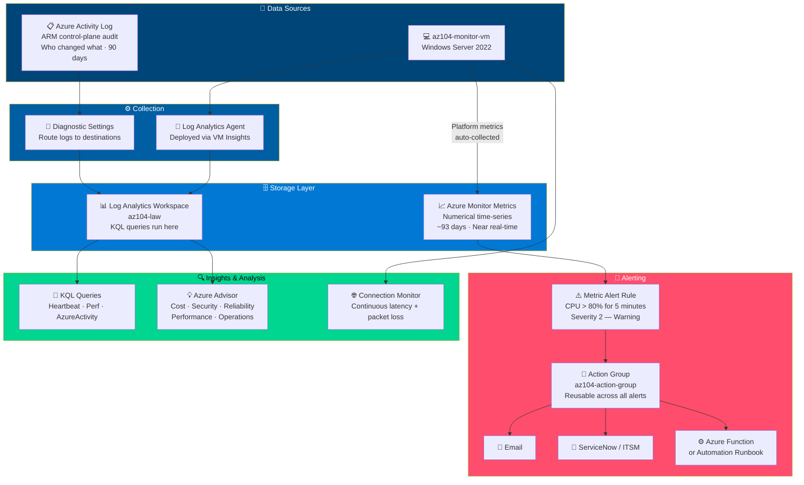
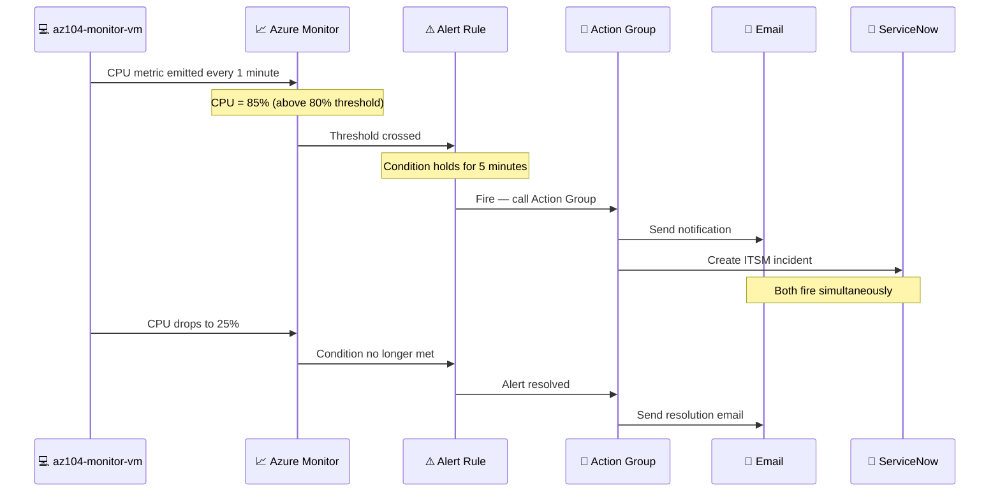
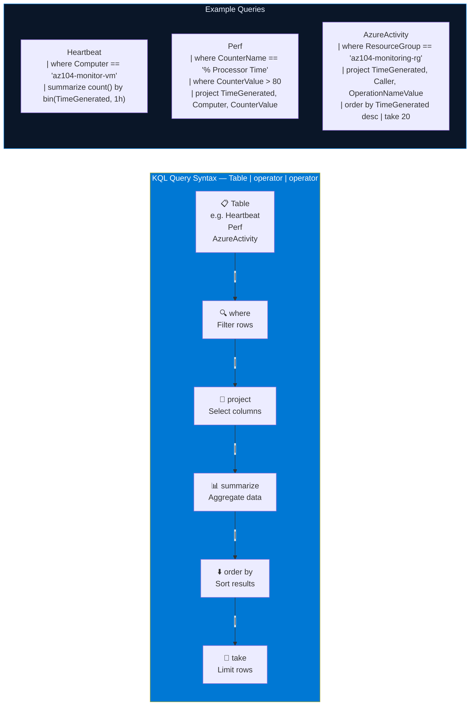
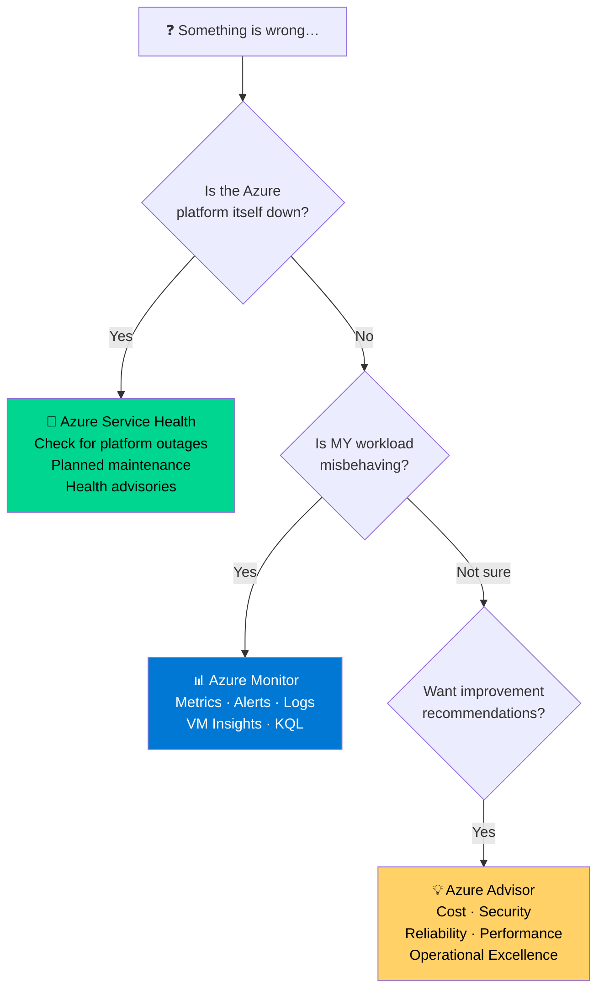

# LAB 11 — Implement Monitoring in Azure

> **Domain:** Monitor and Maintain Azure Resources (10–15%)  
> **Estimated Time:** 60 minutes  
> **Difficulty:** Intermediate  
> **Official Lab:** [MicrosoftLearning/AZ-104 — LAB 11](https://github.com/MicrosoftLearning/AZ-104-MicrosoftAzureAdministrator/blob/master/Instructions/Labs/LAB_11-Implement_Monitoring.md)

---

## Architecture Diagram — Azure Monitor Full Stack



---

## Alert Rule + Action Group Flow



---

## KQL Query Pipeline



---

## Azure Monitor vs Service Health vs Advisor



---

## Objective

By the end of this lab you will be able to:

- Create a **Log Analytics Workspace** and connect resources
- Configure **diagnostic settings** to route logs to multiple destinations
- Create a **metric alert rule** with an **Action Group**
- Write basic **KQL queries** against real log data
- Use the **Activity Log** to audit control-plane changes
- Configure **Connection Monitor** for continuous probing
- Navigate **Azure Advisor** across all 5 pillars

---

## Prerequisites

- Active Azure subscription
- Azure CLI or Cloud Shell
- Resource group created:

```bash
az group create --name az104-monitoring-rg --location eastus
```

---

## Key Concepts

| Service | What It Does | Key Exam Point |
|---|---|---|
| **Metrics** | Numerical time-series (CPU, bytes) | ~93 days retention, near real-time |
| **Log Analytics Workspace** | Central log store queried with KQL | All diagnostic logs funnel here |
| **Activity Log** | WHO changed WHAT (ARM audit trail) | 90-day default retention |
| **Action Group** | What fires when alert triggers | Reusable across multiple alert rules |
| **Metric Alert** | Fires when metric crosses threshold | Always pair with an Action Group |
| **Azure Advisor** | Personalized improvement recommendations | 5 pillars, always free, no config |
| **Service Health** | Microsoft's platform status | Different from Azure Monitor |

---

## Step-by-Step Instructions

### Task 1 — Deploy a VM for Monitoring

```bash
az vm create \
  --resource-group az104-monitoring-rg \
  --name az104-monitor-vm \
  --image Win2022AzureEdition \
  --admin-username az104admin \
  --admin-password Az104Admin@2026! \
  --size Standard_B2s \
  --location eastus
```

---

### Task 2 — Create a Log Analytics Workspace

Portal → **Log Analytics workspaces** → **+ Create**

```
Resource Group:  az104-monitoring-rg
Name:            az104-law
Region:          East US
Pricing tier:    Pay-as-you-go
```

> **Why Log Analytics?** It is the central data store for all Azure Monitor Logs. Diagnostic settings from VMs, NSGs, storage, and other services all send data here. KQL queries run against this workspace.

---

### Task 3 — Enable VM Insights

VM → **Monitoring** → **Insights** → **Enable** → select **az104-law**

Wait ~10 minutes → **Insights** → **Performance** tab → review CPU, Memory, Disk, Network charts

> 📸 **Screenshot checkpoint:** VM Insights Performance tab showing live metrics.

---

### Task 4 — Configure Diagnostic Settings

VM → **Diagnostic settings** → **Enable guest-level monitoring**

```
Log Analytics Workspace:  az104-law
Metrics:   ✅ CPU, Memory, Disk, Network
Logs:      ✅ System, Application, Security event logs
```

> **Exam tip:** Diagnostic settings control WHERE logs go. You can send to Log Analytics Workspace, Storage Account, Event Hub, and a Partner solution — simultaneously if needed.

---

### Task 5 — Create an Action Group

Portal → **Monitor** → **Alerts** → **Action groups** → **+ Create**

```
Action group name:  az104-action-group
Display name:       AZ104Alerts
```

Actions tab → **+ Add action**:
```
Action type:  Email/SMS/Push/Voice
Name:         EmailOnAlert
Email:        your-email@domain.com
```

> **Exam tip:** Action Groups are separate, reusable resources. One Action Group can be attached to many different alert rules. Define the response once — reuse everywhere.

> 📸 **Screenshot checkpoint:** Action Group blade showing the email action configured.

---

### Task 6 — Create a Metric Alert Rule

Portal → **Monitor** → **Alerts** → **+ Create** → **Alert rule**

**Scope:** Select `az104-monitor-vm`

**Condition:**
```
Signal:             Percentage CPU
Operator:           Greater than
Threshold:          80
Aggregation type:   Average
Evaluation period:  5 minutes
Check frequency:    1 minute
```

**Actions:** Select `az104-action-group`

**Details:**
```
Alert rule name:   High-CPU-Alert
Severity:          2 - Warning
Description:       VM CPU exceeded 80% for 5 minutes
```

> 📸 **Screenshot checkpoint:** Alert rule showing the condition and attached Action Group.

---

### Task 7 — Trigger the Alert

Connect to VM via Bastion → open PowerShell → run a CPU stress test:

```powershell
# Stress CPU for several minutes to trigger the alert
$result = 1
1..5000000 | ForEach-Object { $result = $result * 2 / 2 }
```

Portal → **Monitor** → **Alerts** → watch for the alert to fire (~5–10 minutes)

Check your email — you should receive the alert notification

> 📸 **Screenshot checkpoint:** Fired alert in the Alerts blade with Status = Fired.

---

### Task 8 — Write KQL Queries

Portal → **Log Analytics workspaces** → **az104-law** → **Logs**

**Query 1 — VM heartbeats:**
```kql
Heartbeat
| where Computer == "az104-monitor-vm"
| summarize count() by bin(TimeGenerated, 1h)
| order by TimeGenerated desc
```

**Query 2 — High CPU events:**
```kql
Perf
| where ObjectName == "Processor"
| where CounterName == "% Processor Time"
| where CounterValue > 80
| project TimeGenerated, Computer, CounterValue
| order by TimeGenerated desc
```

**Query 3 — Activity log audit:**
```kql
AzureActivity
| where ResourceGroup == "az104-monitoring-rg"
| project TimeGenerated, OperationNameValue, ActivityStatusValue, Caller
| order by TimeGenerated desc
| take 20
```

> **KQL syntax:** Table → | where (filter rows) → | project (choose columns) → | summarize (aggregate) → | order by (sort) → | take (limit results)

> 📸 **Screenshot checkpoint:** KQL query returning results in Log Analytics.

---

### Task 9 — Review the Activity Log

Portal → **Monitor** → **Activity log** → filter by resource group `az104-monitoring-rg`

Click any entry and review:
- **Caller** — who performed the action
- **Operation name** — what was done
- **Resource** — which resource was affected
- **Status** — Succeeded or Failed

> **Exam tip:** Activity Log = the answer to "Who deleted that resource?" or "Who changed that NSG?" It is the ARM control-plane audit trail, retained 90 days by default. Send to Log Analytics Workspace for longer retention.

---

### Task 10 — Configure Connection Monitor

Portal → **Network Watcher** → **Connection monitor** → **+ Create**

Test group:
```
Source:         az104-monitor-vm
Destination:    microsoft.com  (External address)
Protocol:       TCP · Port 443
Test frequency: 30 seconds
```

Wait a few minutes → review **Latency** and **% checks passed** over time

> **Exam distinction:** Connection Monitor = continuous monitoring with latency and packet loss trends over time. IP Flow Verify = instant single on-demand NSG rule check.

---

### Task 11 — Check Azure Advisor

Portal → **Advisor** → review recommendations across all 5 pillars:

| Pillar | Examples |
|---|---|
| **Cost** | Resize underutilized VMs, delete unattached disks |
| **Security** | Enable MFA, apply missing patches, enable Defender |
| **Reliability** | Add VM backup, configure HA, enable replication |
| **Performance** | Upgrade throttled storage SKUs, add CDN |
| **Operational Excellence** | Fix deprecated API usage, add required tags |

> **Exam tip:** Azure Advisor is always free, requires zero configuration, and continuously evaluates your resources automatically.

---

### Task 12 — Clean Up Resources

```bash
az group delete --name az104-monitoring-rg --yes --no-wait
```

---

## Troubleshooting

| Issue | Resolution |
|---|---|
| Alert doesn't fire | Check evaluation period — may need longer wait; verify threshold value |
| No data in Log Analytics | Agent install takes 10–15 min; diagnostic settings take ~5 min to flow |
| KQL returns no results | Adjust time range — default is 24 hours; new VMs may need more time |
| Email not received | Check spam folder; verify email in Action Group; confirm alert Status = Fired |
| Connection Monitor shows 100% packet loss | Check NSG rules for outbound rules blocking test traffic |

---

## Exam Topics Covered

- [ ] Create a Log Analytics Workspace and connect VMs via VM Insights
- [ ] Configure diagnostic settings to route logs to Log Analytics
- [ ] Create a reusable Action Group with multiple action types
- [ ] Create a metric alert rule attached to an Action Group
- [ ] Write KQL queries against Heartbeat, Perf, and AzureActivity tables
- [ ] Use the Activity Log to audit who changed what and when
- [ ] Configure Connection Monitor for continuous end-to-end probing
- [ ] Navigate Azure Advisor and explain all 5 recommendation pillars
- [ ] Distinguish Azure Monitor, Azure Service Health, and Azure Advisor

---

## Official Resources

- [Azure Monitor overview](https://learn.microsoft.com/en-us/azure/azure-monitor/overview)
- [Log Analytics workspace](https://learn.microsoft.com/en-us/azure/azure-monitor/logs/log-analytics-workspace-overview)
- [KQL quick reference](https://learn.microsoft.com/en-us/azure/data-explorer/kql-quick-reference)
- [Azure Advisor overview](https://learn.microsoft.com/en-us/azure/advisor/advisor-overview)
- [Official Lab 11 Instructions](https://github.com/MicrosoftLearning/AZ-104-MicrosoftAzureAdministrator/blob/master/Instructions/Labs/LAB_11-Implement_Monitoring.md)

---

*Glen Page | Cloud Engineer | [github.com/glenpagesr-dev](https://github.com/glenpagesr-dev)*
