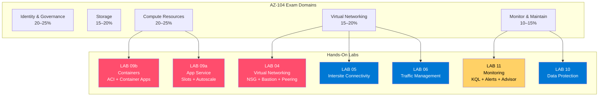

[README.md](https://github.com/user-attachments/files/28949002/README.md)
# AZ-104 Retake Prep — Hands-On Lab Repository

> **Glen Page** | Cloud Engineer | Monroe, NY  
> 🔗 [GitHub](https://github.com/glenpagesr-dev) · [LinkedIn](https://www.linkedin.com/in/glen-page-862730246)

---

## About This Repository

This repository documents hands-on Azure labs aligned to the **AZ-104 Microsoft Azure Administrator** exam objectives (April 18, 2025). Each lab maps directly to a specific exam domain and includes step-by-step instructions, architecture diagrams, exam tips, and troubleshooting guides.

---

## Lab Map — Domains to Labs



---

## Lab Completion Tracker

| # | Lab | Domain | Est. Time | Status |
|---|---|---|---|---|
| 1 | [LAB 09b — Azure Containers (ACI + Container Apps)](./LAB_09b-Implement_Azure_Containers.md) | Compute | 60 min | ⬜ Not Started |
| 2 | [LAB 09a — Azure App Service](./LAB_09a-Implement_Azure_App_Service.md) | Compute | 60 min | ⬜ Not Started |
| 3 | [LAB 04 — Virtual Networking](./LAB_04-Implement_Virtual_Networking.md) | Networking | 75 min | ⬜ Not Started |
| 4 | [LAB 11 — Implement Monitoring](./LAB_11-Implement_Monitoring.md) | Monitor & Maintain | 60 min | ⬜ Not Started |

> Update each status to ✅ Complete as you finish each lab.

---

## Key Facts to Memorize

### Networking
```
Subnet IP math:    /24 = 256 total − 5 reserved = 251 usable
NSG priority:      Lower number = evaluated FIRST (100 beats 4000)
VNet peering:      NOT transitive — A↔B + B↔C ≠ A↔C
Bastion subnet:    Must be named AzureBastionSubnet, minimum /26
Service Endpoint:  PaaS still has public IP (just firewall-restricted)
Private Endpoint:  PaaS gets private IP in your VNet — public access can be fully disabled
UDR 0.0.0.0/0:    Forces all internet traffic through firewall (forced tunneling)
```

### Compute — Containers
```
ACI:             Simple, on-demand, billed per second, no autoscale
Container Apps:  Serverless microservices, HTTP/event autoscale, scale-to-zero
AKS:             Full Kubernetes cluster management
ACR:             Private Docker image registry (Basic / Standard / Premium)
ACR Premium:     Required for geo-replication + private link
```

### Compute — App Service
```
Deployment slots:  Requires Standard tier or higher
Slot swap:         Zero downtime — swap BACK to revert instantly
Scale Up:          Bigger VM (change tier)
Scale Out:         More instances (autoscale rules on the Plan)
VNet Integration:  OUTBOUND from App Service to VNet only
CNAME:             For subdomains (www.contoso.com)
A record:          For apex domains (contoso.com — no subdomain prefix)
```

### Monitor & Maintain
```
Activity Log:   WHO changed WHAT — 90-day retention — ARM audit trail
Metrics:        Numerical, ~93 days, near real-time, threshold alerts
Log Analytics:  All logs live here, queried with KQL
Action Group:   REUSABLE — what happens when an alert fires
ASR RPO:        ~15 minutes
ASR RTO:        ~1–2 hours
Azure Advisor:  5 pillars — Cost, Security, Reliability, Performance, Ops
Service Health: Microsoft platform status — NOT your workload health
```

---

## Official Resources

| Resource | URL | Purpose |
|---|---|---|
| Microsoft Learn | [AZ-104 Learning Paths](https://learn.microsoft.com/en-us/training/paths/az-104-manage-identities-governance/) | Deep reading per domain |
| Free Practice Assessment | [Microsoft](https://learn.microsoft.com/en-us/credentials/certifications/azure-administrator/) | Benchmark exam readiness |
| Official Lab Repo | [MicrosoftLearning GitHub](https://github.com/MicrosoftLearning/AZ-104-MicrosoftAzureAdministrator) | Source lab instructions |
| Exam Objectives | [AZ-104 Study Guide](https://learn.microsoft.com/en-us/credentials/certifications/resources/study-guides/az-104) | April 2025 skills measured |
| Azure Portal | [portal.azure.com](https://portal.azure.com) | Hands-on lab environment |
| Azure Free Credits | [azure.microsoft.com/free](https://azure.microsoft.com/free) | $200 free credit for labs |

---

*Glen Page | Cloud Engineer | [github.com/glenpagesr-dev](https://github.com/glenpagesr-dev)*
